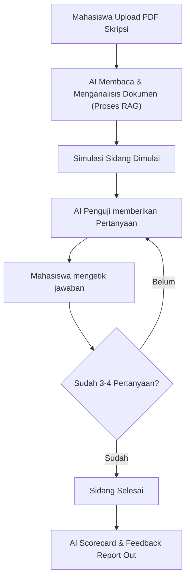

# Minimum Viable Product (MVP) - Dosen Penguji Virtual

## 1. Alur Pengguna (User Flow) MVP

Agar tidak terlalu rumit, kita batasi interaksi menggunakan **berbasis teks (chat)** terlebih dahulu sebelum melangkah ke fitur suara (*voice*).

---

## 2. Arsitektur Teknis & Stack Teknologi MVP (Rekomendasi)

Pilihlah *stack* yang cepat diimplementasikan dan memiliki dokumentasi luas.

* **Frontend (Antarmuka):** **Streamlit** atau **Gradio** (Python-based). Anda tidak perlu memikirkan HTML/CSS/JS yang rumit. Cukup beberapa baris kode Python untuk membuat halaman unggah dokumen dan kolom *chat*.
* **Backend & Orkestrasi:** **LangChain** atau **LlamaIndex**. Ini digunakan untuk menghubungkan dokumen skripsi dengan AI.
* **LLM Brain:** **OpenAI GPT-4o mini** atau **Anthropic Claude 3.5 Haiku**. Model-model ini sangat cerdas, memiliki *context window* besar untuk membaca seluruh isi skripsi, namun biayanya sangat murah untuk tahap MVP.
* **Database Sementara:** **ChromaDB** (bisa berjalan secara lokal di komputer Anda tanpa perlu sewa server *database* *vector*).

---

## 3. Komponen Utama Kode (The Core Logic)

Untuk membangun MVP ini, Anda hanya perlu berfokus pada tiga bagian *system prompt* utama:

### A. Pengondisian Awal (Ingestion & Context)

Saat mahasiswa mengunggah PDF, sistem akan mengekstrak teksnya. LLM akan diberikan instruksi awal:

> "Anda adalah seorang Dosen Penguji Sidang Skripsi yang sangat teliti, objektif, namun suportif. Tugas Anda adalah membaca dokumen skripsi berikut dan menguji pemahaman mahasiswa secara mendalam. Ajukan pertanyaan satu per satu. Tunggu jawaban mahasiswa sebelum mengajukan pertanyaan berikutnya."

### B. Strategi Pembuatan Pertanyaan (The Interviewer)

Batasi jumlah pertanyaan (misalnya, maksimal 4 pertanyaan) dengan fokus yang terstruktur:

* **Pertanyaan 1:** Validasi Latar Belakang & *Research Gap* (Mengapa penelitian ini penting?).
* **Pertanyaan 2:** Metodologi (Mengapa memilih metode ini? Bagaimana validitas datanya?).
* **Pertanyaan 3:** Hasil & Pembahasan (Apakah temuan Anda benar-benar menjawab rumusan masalah?).
* **Pertanyaan 4:** *Stress-test* / Pertanyaan Kritis (Apa keterbatasan terbesar dari penelitian Anda ini?).

### C. Laporan Hasil (Evaluation Engine)

Setelah pertanyaan terakhir dijawab, instruksikan AI untuk keluar dari persona penguji dan berubah menjadi **Dosen Pembimbing yang memberikan evaluasi**. Output akhir harus terstruktur:

> ### 📊 Hasil Evaluasi Simulasi Sidang
>
>
> ---
>
>
> * **Status Kelulusan (Simulasi):** [Lulus dengan Revisi / Tidak Lulus]
> * **Nilai Estimasi:** [A / B+ / B / C]
>
>
> ### 💡 Analisis Kekuatan & Kelemahan
>
>
> * **Kekuatan:** (Apa yang sudah dijawab dengan baik oleh mahasiswa)
> * **Kelemahan/Celah:** (Di mana argumen mahasiswa terasa lemah atau tidak konsisten)
>
>
> ### 🛠️ Rekomendasi Revisi Sebelum Sidang Asli
>
>
> 1. Perbaiki penjelasan sampel di Bab 3 karena argumen Anda tadi kurang kuat.
> 2. Sinkronkan kesimpulan di Bab 5 dengan rumusan masalah nomor 2.
>
>

---

## 4. Cara Mengatasi "Halusinasi" pada Tahap MVP

Agar AI tidak menanyakan hal yang tidak ada di skripsi mahasiswa, gunakan teknik **Strict RAG Prompting**. Di dalam *prompt* internal, Anda wajib menuliskan aturan ini:

> *"Setiap pertanyaan yang Anda ajukan harus berdasarkan data, teks, atau metodologi yang tertulis di dokumen skripsi yang disediakan. Jika Anda ingin mempertanyakan sesuatu yang TIDAK ada di dokumen, Anda harus menyatakannya sebagai 'Mengapa hal X tidak dimasukkan ke dalam skripsi Anda?' Jangan berasumsi atau mengarang data baru."*

---

## 5. Rencana Aksi (Action Plan) 2 Minggu

Jika Anda ingin langsung mengeksekusinya, berikut *timeline* singkatnya:

* **Hari 1-3:** Setup lingkungan Python, install Streamlit dan LangChain. Buat UI sederhana untuk *upload* PDF.
* **Hari 4-7:** Implementasikan fungsi membaca PDF dan hubungkan ke API LLM. Uji coba dengan skripsi lama Anda sendiri untuk melihat apakah AI bisa memahaminya.
* **Hari 8-11:** Tulis *system prompt* untuk logika tanya-jawab bergilir (looping chat) dan pembuatan *Feedback Report*.
* **Hari 12-14:** Minta 3-5 teman mahasiswa tingkat akhir untuk mencoba (Beta Test) dan kumpulkan masukan mereka.
